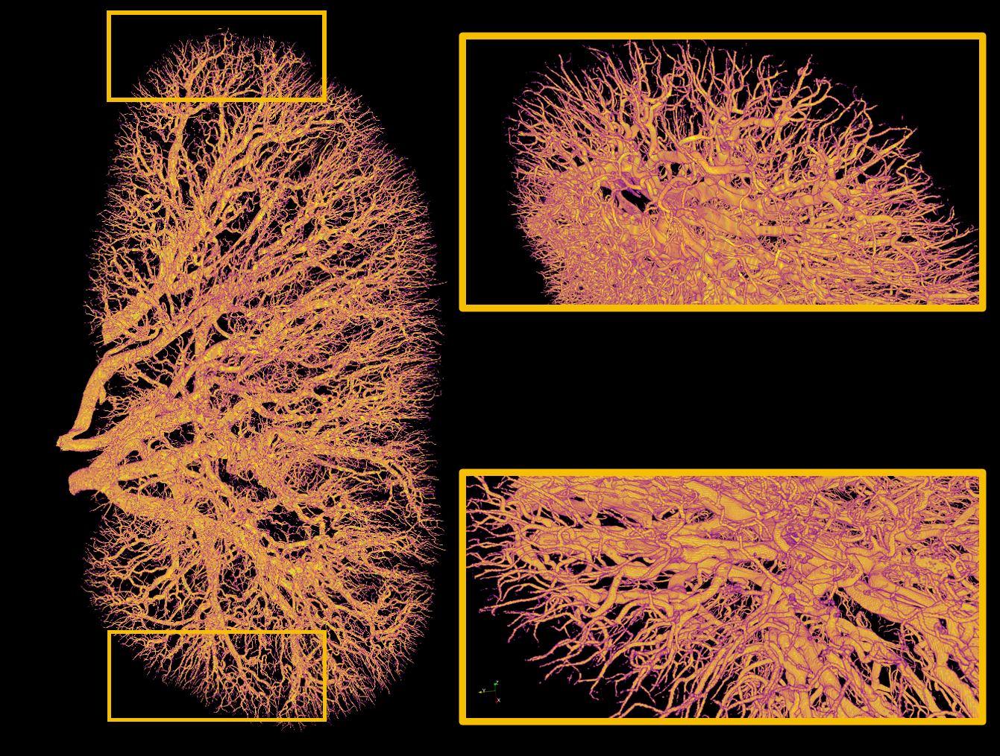
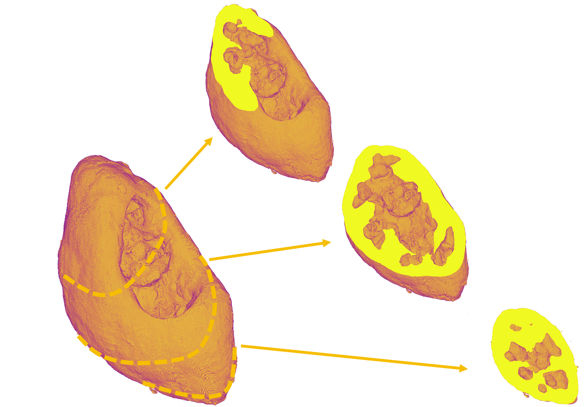

# 2.5D U-Net for Vascular Segmentation (HiP-CT)

Codebase for supervised segmentation of vasculature in 3D HiP-CT volumes using a **2.5D U-Net** (stacked slices as channels with 2D convolutions).  
This repository adapts and refactors the **Team-1** solution from the SenNet + HOA Kaggle competition, as described in the paper below.

- 📄 **Primary reference:** *Vasculature segmentation in 3D hierarchical phase-contrast tomography images of human kidneys* (bioRxiv, 2024)  
  https://www.biorxiv.org/content/10.1101/2024.08.25.609595v1
- 🔗 **Upstream source (Team-1):** https://github.com/cns-iu/hra-sennet-hoa-kaggle-2024/tree/main/winning-team-solutions/team-1

---

## Example Segmentation

*Figure: Example output from the adapted 2.5D U-Net pipeline for arteries segmentation.*

*Figure: Example output from the adapted 2.5D U-Net pipeline for cortex segmentation.*
